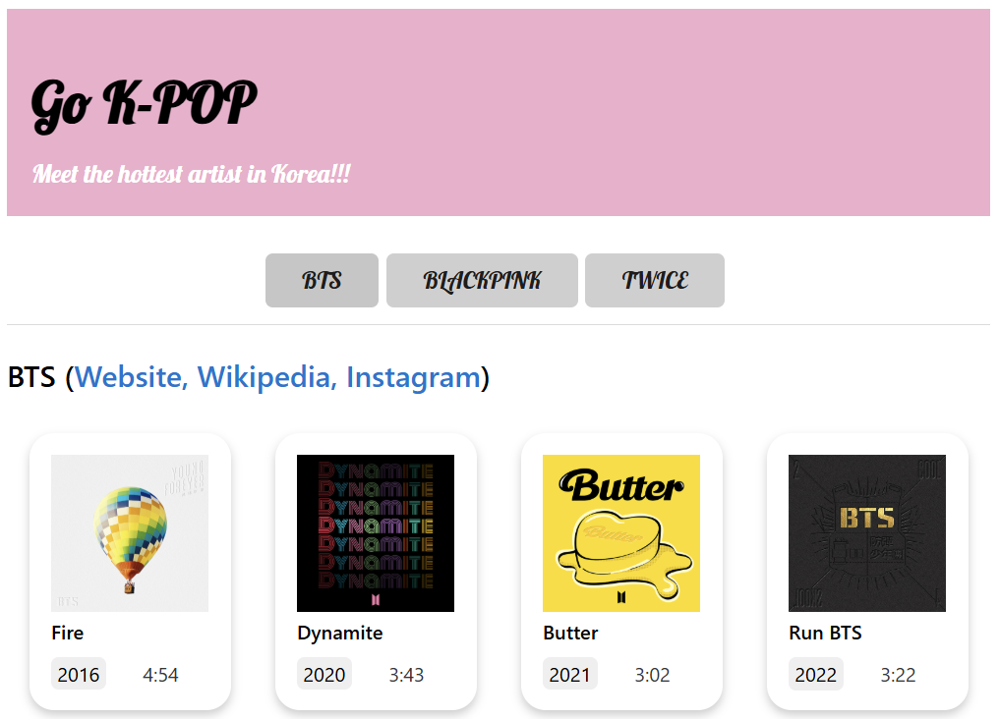

# 🎵 Artist Explorer

> A web app to explore your favorite artists' music and social platforms. Click, explore, and request new artists!
<br>

## 🚀 Features
- 🎥 **YouTube Integration**: Click on any card to open the YouTube page for the specific song.
- 🔄 **Dynamic Artist Updates**: Use the buttons to refresh the song list for a selected artist.
- 🌐 **Social Links**: Access the artist's official website, Wikipedia, and Instagram through hyperlinks.
- 📝 **Artist Request Form**: Request new artists through the form (Backend functionality in progress).
<br>

## 📖 Usage

1. Open the app in your browser.
2. Click on a song card to open its YouTube page.
3. Use the artist buttons to dynamically update the song list for the selected artist.
4. Click on the social links (Website, Wikipedia, Instagram) for more information about each artist.
5. Use the Request Artist button to open the artist request form (**feature coming soon**).
<br>

## 🖼️ Screenshots

<br><br>

## 📂 Project Structure
```plaintext
.vscode/             # Visual Studio Code workspace settings
src/                 # Source code for the application
├── css/             # CSS files for styling
│   ├── styles.css   # Main stylesheet
│   ├── water.css    # CSS framework that provides basic styling
├── js/              # JavaScript files for functionality
│   ├── app.js       # Core application logic
│   ├── artists.js   # The app's list of artists
│   ├── songs.js     # The app's list of songs
├── index.html       # Main HTML file
├── request.html     # Request form HTML file
.eslintrc.js         # ESLint configuration for code quality
.gitignore           # Files to be ignored by Git
.prettierrc.js       # Prettier configuration for code formatting
README.md            # Project documentation
package-lock.json    # Exact dependency versions
package.json         # Project metadata and dependencies
```
<br>

## 🛠️ Tech Stack

- HTML5
- CSS3 (Custom styles and Water.css)
- JavaScript (Vanilla JS)
<br>

## 📞 Contact

- Author: Soso Kim
- GitHub: https://github.com/yakongs
- Email: rtgm1215@gmail.com
